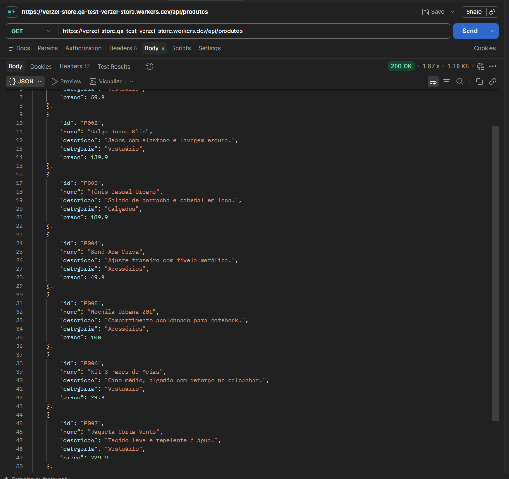
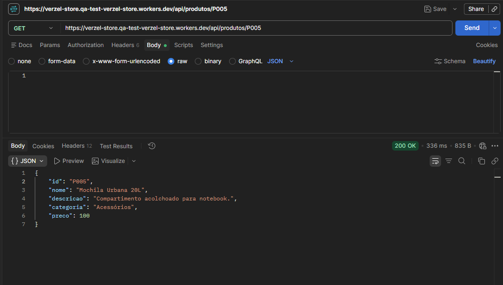
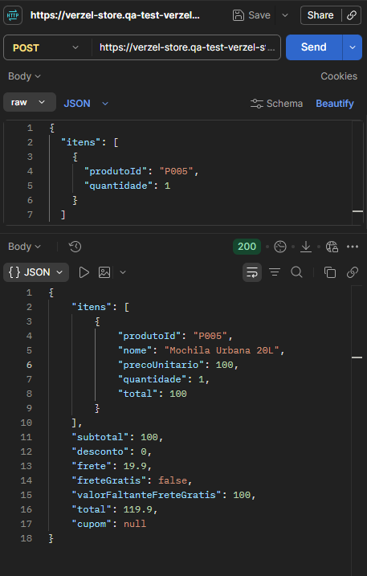
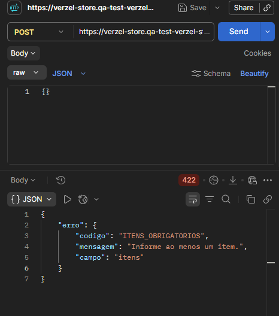
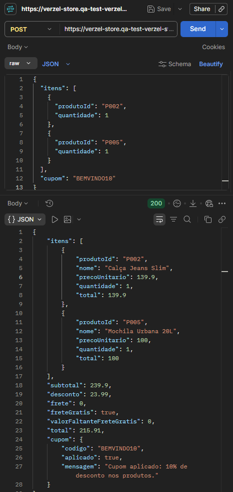
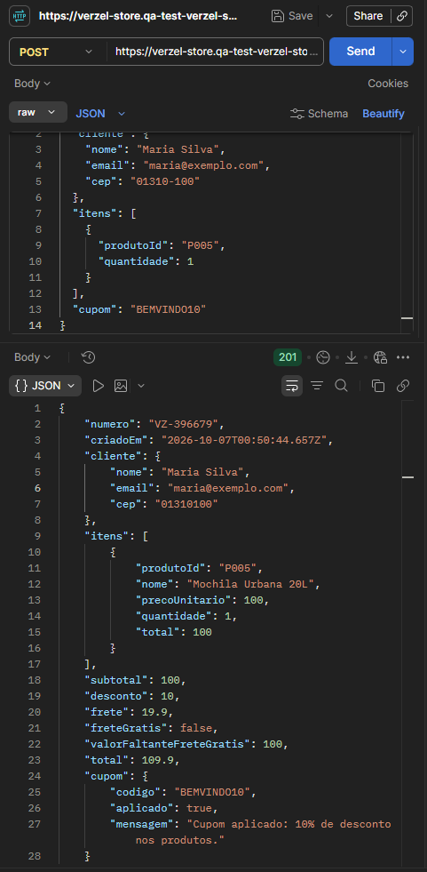

# Execução dos Testes - API

## API-CT001-Consultar lista de produtos

**Status:** ✅ PASS

**Método:** GET  
**Endpoint:** `/api/produtos`

**Resultado esperado:**  
A API deve retornar status HTTP 200 e apresentar a lista de produtos disponíveis.

**Resultado obtido:**  
A API retornou status HTTP 200 e apresentou a lista de produtos disponíveis, contendo informações como ID, nome, descrição, categoria e preço.

**Conclusão:**  
O comportamento está de acordo com o esperado.

**Evidência:**

---

## API-CT002 - Consultar produto existente por ID

**Status:** ✅ PASS

**Método:** GET  
**Endpoint:** `/api/produtos/P005`

**Resultado esperado:**  
A API deve retornar status HTTP 200 e os dados correspondentes ao produto de ID "P005".

**Resultado obtido:**  
A API retornou status HTTP 200 e apresentou corretamente os dados do produto "P005" - Mochila Urbana 20L.

**Conclusão:**  
O comportamento está de acordo com o esperado.

**Evidência:**

---

## API-CT003 - Consultar produto inexistente

**Status:** ✅ PASS

**Método:** GET  
**Endpoint:** `/api/produtos/P999`

**Resultado esperado:**  
A API deve retornar status HTTP 404 e o código de erro "PRODUTO_NAO_ENCONTRADO".

**Resultado obtido:**  
A API retornou status HTTP 404 e informou que o produto não foi encontrado, conforme esperado.

**Conclusão:**  
O comportamento está de acordo com o esperado.

**Evidência:**

---

## API-CT004 - Calcular carrinho com dados válidos

**Status:** ✅ PASS

**Método:** POST  
**Endpoint:** `/api/carrinho/calcular`

**Resultado esperado:**  
A API deve retornar status HTTP 200 e calcular o carrinho com subtotal de R$ 100,00, desconto de R$ 0,00, frete de R$ 19,90, valor faltante para frete grátis de R$ 100,00 e total de R$ 119,90.

**Resultado obtido:**  
A API retornou status HTTP 200, com subtotal de R$ 100,00, desconto de R$ 0,00, frete de R$ 19,90, frete grátis como falso, valor faltante de R$ 100,00 e total de R$ 119,90.

**Conclusão:**  
O comportamento está de acordo com o esperado.

**Evidência:**

---

## API-CT005 - Calcular carrinho sem informar itens

**Status:** ✅ PASS

**Método:** POST  
**Endpoint:** `/api/carrinho/calcular`

**Resultado esperado:**  
A API deve retornar status HTTP 422 e o código de erro "ITENS_OBRIGATORIOS" ao tentar calcular um carrinho sem informar itens.

**Resultado obtido:**  
A API retornou status HTTP 422, com o código "ITENS_OBRIGATORIOS", a mensagem "Informe ao menos um item." e o campo "itens".

**Conclusão:**  
O comportamento está de acordo com o esperado.

**Evidência:**

---

## API-CT006  Calcular carrinho com múltiplos produtos, cupom e frete grátis

**Status:** ✅ PASS

**Método:** POST  
**Endpoint:** `/api/carrinho/calcular`

**Resultado esperado:**  
A API deve retornar status HTTP 200, subtotal de R$ 239,90, desconto de R$ 23,99, frete de R$ 0,00, frete grátis como verdadeiro e total de R$ 215,91.

**Resultado obtido:**  
A API retornou status HTTP 200 e realizou corretamente o cálculo do carrinho com múltiplos produtos e o cupom BEMVINDO10. O subtotal foi de R$ 239,90, o desconto de R$ 23,99, o frete foi gratuito e o total resultou em R$ 215,91.

**Conclusão:**  
O comportamento está de acordo com o esperado, incluindo a aplicação do desconto e a aplicação do frete grátis com base no subtotal anterior ao desconto.

**Evidência:**

---

## API-CT007- Criar pedido com dados válidos e cupom

**Status:** ✅ PASS

**Método:** POST  
**Endpoint:** `/api/pedidos`

**Resultado esperado:**  
A API deve retornar status HTTP 201, gerar um número de pedido no formato "VZ-000000" e apresentar o resumo correto da compra, considerando o cupom BEMVINDO10.

**Resultado obtido:**  
A API retornou status HTTP 201 e gerou o pedido "VZ-396679". O subtotal foi de R$ 100,00, o desconto de R$ 10,00, o frete de R$ 19,90 e o total de R$ 109,90. O cupom BEMVINDO10 foi retornado como aplicado.

**Conclusão:**  
O comportamento está de acordo com o esperado.

**Evidência:**

---