# Execução dos Testes Verzel Store

## Testes Funcionais / Interface

### CT-001 - Aplicar o cupom BEMVINDO10 sobre o subtotal

**Critério relacionado:** CA01  
**Status:** ✅ PASSOU  
**Evidência:** EV-CT001  

**Resultado esperado:**  
Aplicar 10% de desconto sobre o subtotal de R$ 100,00. O desconto deve ser de R$ 10,00 e o total do pedido deve ser R$ 109,90.

**Resultado obtido:**  
O cupom foi aplicado com sucesso.

- Subtotal: R$ 100,00
- Desconto: R$ 10,00
- Frete: R$ 19,90
- Total: R$ 109,90
- Faltante para frete grátis: R$ 100,00

**Conclusão:**  
O comportamento está de acordo com o especificado no CA01.

**Evidência:** 
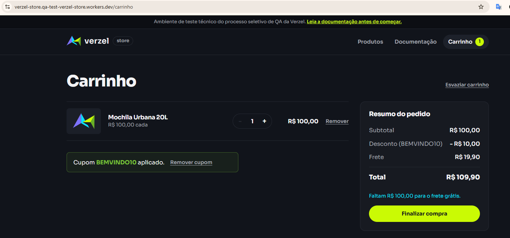

### CT-002 - Aplicar cupom utilizando letras minúsculas

**Critério relacionado:** CA02  
**Status:** ✅ PASSOU  
**Evidência:** EV-CT002  

**Resultado esperado:**  
O cupom `bemvindo10` deve ser reconhecido independentemente do uso de letras maiúsculas ou minúsculas e aplicar 10% de desconto.

**Resultado obtido:**  
O cupom foi aplicado com sucesso utilizando letras minúsculas, concedendo o desconto esperado de 10%.

**Conclusão:**  
O comportamento está de acordo com o especificado no CA02.

**Evidência:**
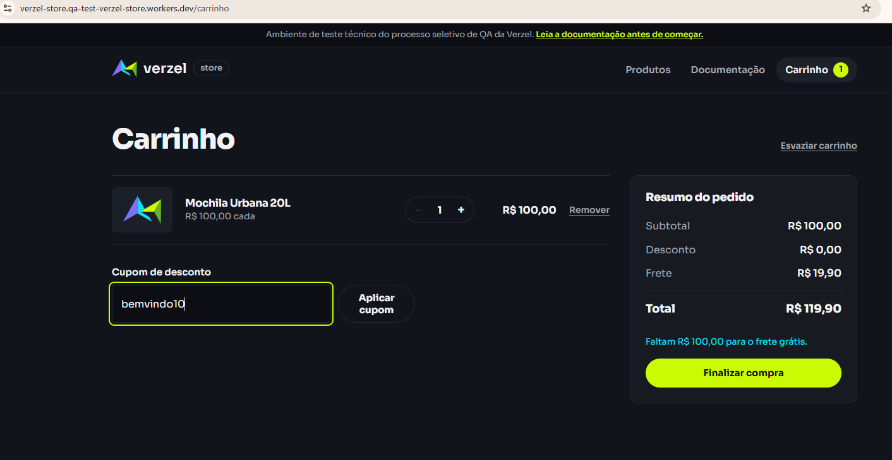
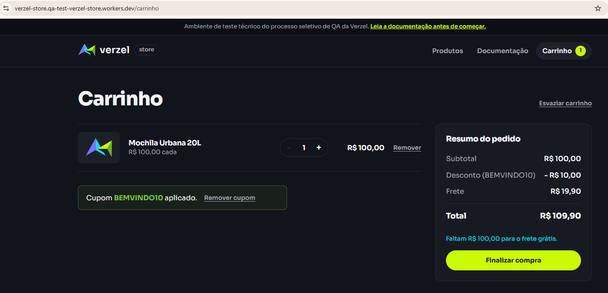

---

### CT-003 - Aplicar cupom com espaços no início e no fim

**Critério relacionado:** CA02  
**Status:** ✅ PASSOU  
**Evidência:** EV-CT003  

**Resultado esperado:**  
Os espaços existentes no início e no fim do código devem ser ignorados e o cupom `BEMVINDO10` deve ser aplicado normalmente.

**Resultado obtido:**  
O cupom foi reconhecido mesmo contendo espaços no início e no fim, aplicando corretamente o desconto de 10%.

**Conclusão:**  
O comportamento está de acordo com o especificado no CA02.

**Evidência:**
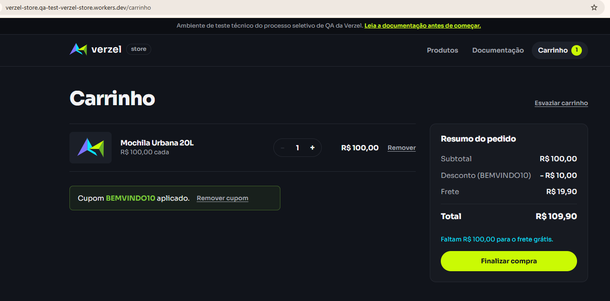

---

### CT-004 - Tentar aplicar um cupom inexistente

**Critério relacionado:** CA03  
**Status:** ✅ PASSOU 
**Evidência:** EV-CT004  

**Resultado esperado:**  
Ao informar um cupom inexistente, deve ser exibida a mensagem "Cupom inválido." e nenhum desconto deve ser aplicado.

**Resultado obtido:**  
A aplicação exibiu a mensagem "Cupom inválido." e nenhum desconto foi aplicado ao pedido.

**Conclusão:**  
O comportamento está de acordo com o especificado no CA03.

**Evidência:**
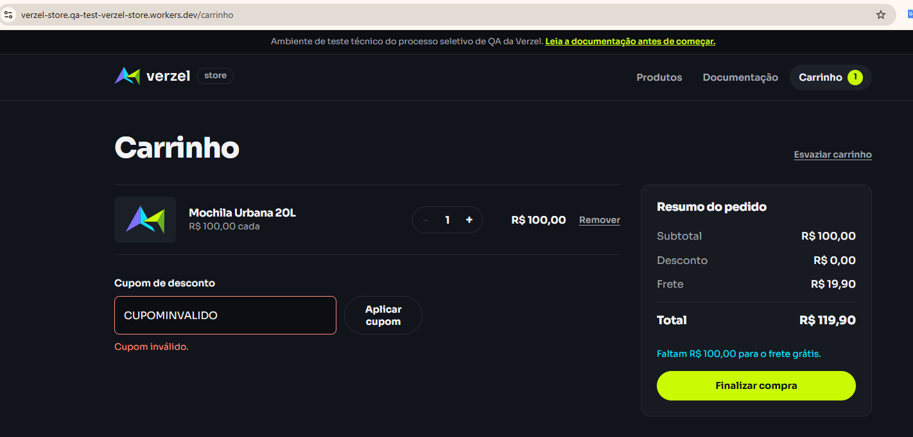

---

### CT-005 - Tentar aplicar um cupom expirado

**Critério relacionado:** CA04  
**Status:** ✅ PASSOU 
**Evidência:** EV-CT005  

**Resultado esperado:**  
Ao informar o cupom expirado `VERAO2026`, deve ser exibida a mensagem "Cupom expirado." e nenhum desconto deve ser aplicado.

**Resultado obtido:**  
A aplicação exibiu a mensagem "Cupom expirado." e nenhum desconto foi aplicado ao pedido.

**Conclusão:**  
O comportamento está de acordo com o especificado no CA04.

**Evidência:**
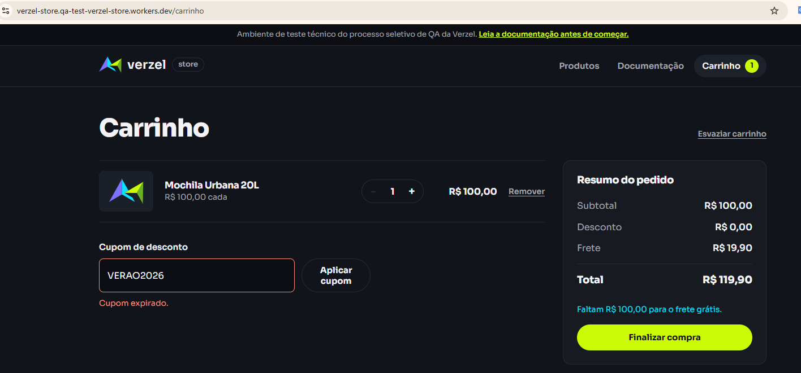

---

### CT-006 - Remover um cupom aplicado

**Critério relacionado:** CA05  
**Status:** ✅ PASSOU 
**Evidências:** EV-CT006-01 e EV-CT006-02  

**Resultado esperado:**  
Ao remover o cupom aplicado, o desconto deve ser retirado e o total do pedido recalculado. Após a remoção, o cliente deve poder informar outro cupom.

**Resultado obtido:**  
O cupom BEMVINDO10 foi removido com sucesso. O desconto passou de R$ 10,00 para R$ 0,00 e o total foi atualizado de R$ 109,90 para R$ 119,90. Após a remoção, o campo para aplicação de cupom voltou a ser disponibilizado.

**Conclusão:**  
O comportamento está de acordo com o especificado no CA05.

**Evidências:**

**Cupom aplicado:**
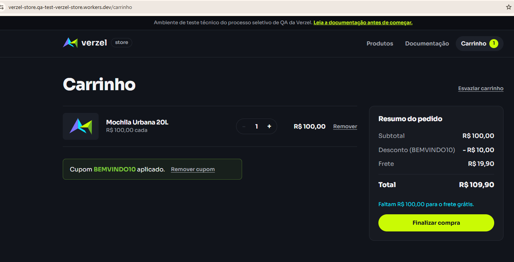

**Após remoção:**

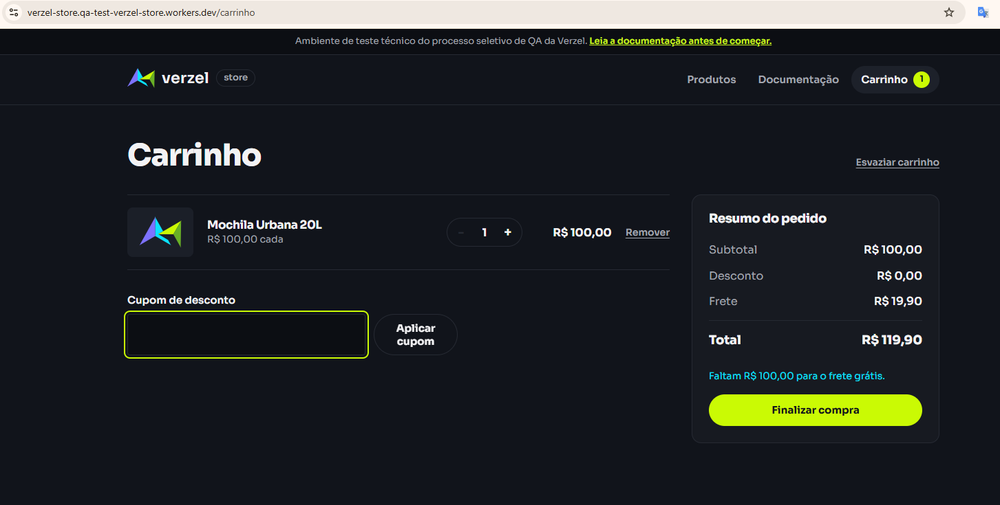

---

### CT-007 - Validar frete abaixo do limite de R$ 200,00

**Critérios relacionados:** CA06, CA07  
**Técnica:** Análise de Valor Limite  
**Status:** ✅ PASSOU 
**Evidência:** EV-CT007  

**Resultado esperado:**  
Para o subtotal de R$ 199,80, deve ser cobrado frete fixo de R$ 19,90 e informado que faltam R$ 0,20 para obter frete grátis. O total deve ser R$ 219,70.

**Resultado obtido:**  
Com subtotal de R$ 199,80, foi cobrado frete de R$ 19,90. A aplicação informou que faltam R$ 0,20 para o frete grátis e apresentou total de R$ 219,70.

**Conclusão:**  
O comportamento está de acordo com os critérios CA06 e CA07.

**Evidência:**
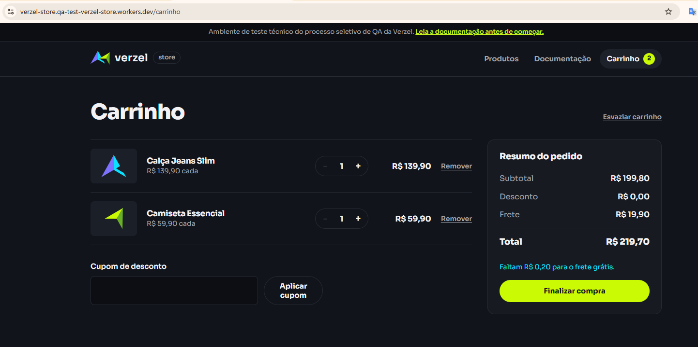

---

### CT-008 - Validar frete grátis exatamente no limite de R$ 200,00

**Critério relacionado:** CA06  
**Técnica:** Análise de Valor Limite  
**Status:** ❌ FALHOU
**Bug relacionado:** BUG-001  
**Evidência:** EV-CT008  

**Resultado esperado:**  
Para um subtotal exatamente igual a R$ 200,00, o frete deve ser grátis, conforme definido no CA06.

**Resultado obtido:**  
Com subtotal de R$ 200,00, foi cobrado frete de R$ 19,90 e o total apresentado foi R$ 219,90. A interface também informou "Faltam R$ 0,00 para o frete grátis."

**Conclusão:**  
O comportamento não está de acordo com o CA06. O limite de R$ 200,00 não está concedendo frete grátis.

**Evidência:**
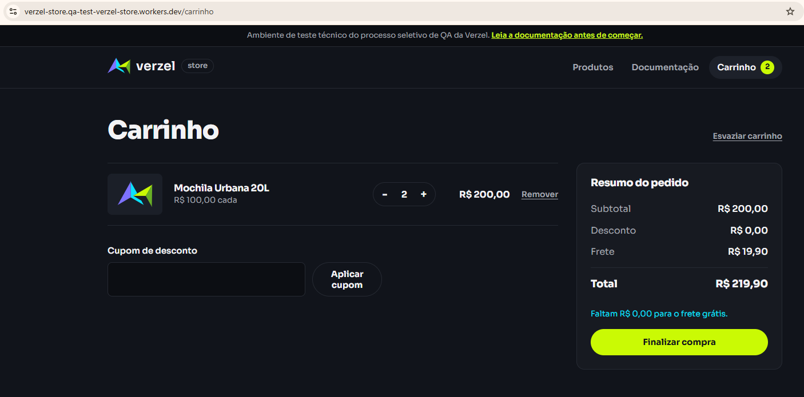

---

### CT-009 - Validar frete grátis acima de R$ 200,00

**Critério relacionado:** CA06  
**Técnica:** Análise de Valor Limite  
**Status:** ✅ PASSOU  
**Evidência:** EV-CT009  

**Resultado esperado:**  
Para um subtotal superior a R$ 200,00, o frete deve ser grátis. Com subtotal de R$ 229,90, o total do pedido deve permanecer R$ 229,90.

**Resultado obtido:**  
Com subtotal de R$ 229,90, a aplicação concedeu frete grátis e apresentou total de R$ 229,90.

**Conclusão:**  
O comportamento está de acordo com o especificado no CA06.

**Evidência:**
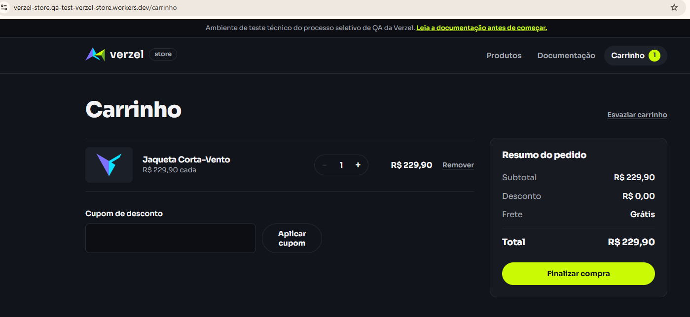

---

### CT-009-1 - Validar frete grátis no limite de R$ 200,00 pela API

**Critério relacionado:** CA06  
**Camada:** API  
**Status:** ❌ FALHOU
**Evidência:** EV-CT016  
**Bug relacionado:** BUG-001  

**Resultado esperado:**  
Para um subtotal exatamente igual a R$ 200,00, a API deve oferecer frete grátis, retornando "frete" igual a 0, "freteGratis" igual a true, "valorFaltanteFreteGratis" igual a 0 e total de R$ 200,00.

**Resultado obtido:**  
A API retornou status HTTP 200 e subtotal de R$ 200,00, porém retornou "frete" igual a 19.9, "freteGratis" igual a false e total igual a 219.9. O campo "valorFaltanteFreteGratis" foi retornado como 0.

**Conclusão:**  
O comportamento não está de acordo com o CA06. O defeito identificado no BUG-001 também ocorre diretamente na API.

**Evidência:**
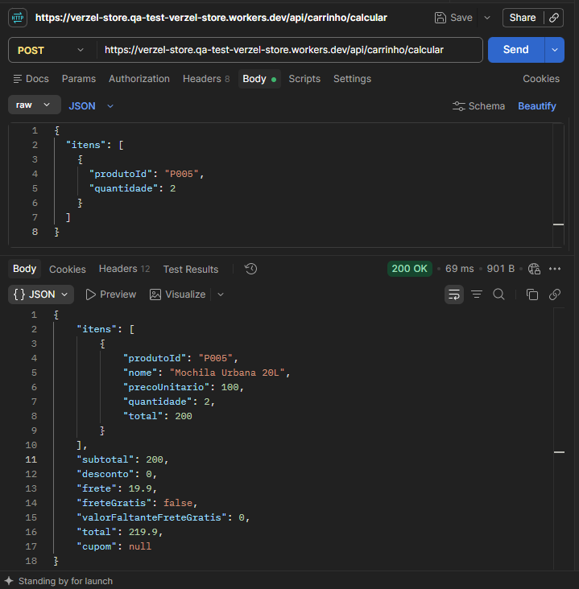

---

### CT-010 - Validar frete e valor faltante abaixo de R$ 200,00

**Critério relacionado:** CA07  
**Status:** ✅ PASSOU  
**Evidência:** EV-CT010  

**Resultado esperado:**  
Com subtotal de R$ 100,00, deve ser cobrado frete fixo de R$ 19,90. O carrinho deve informar que faltam R$ 100,00 para obter frete grátis e o total deve ser R$ 119,90.

**Resultado obtido:**  
Com subtotal de R$ 100,00, a aplicação cobrou frete de R$ 19,90, informou que faltam R$ 100,00 para obter frete grátis e apresentou total de R$ 119,90.

**Conclusão:**  
O comportamento está de acordo com o especificado no CA07.

**Evidência:**
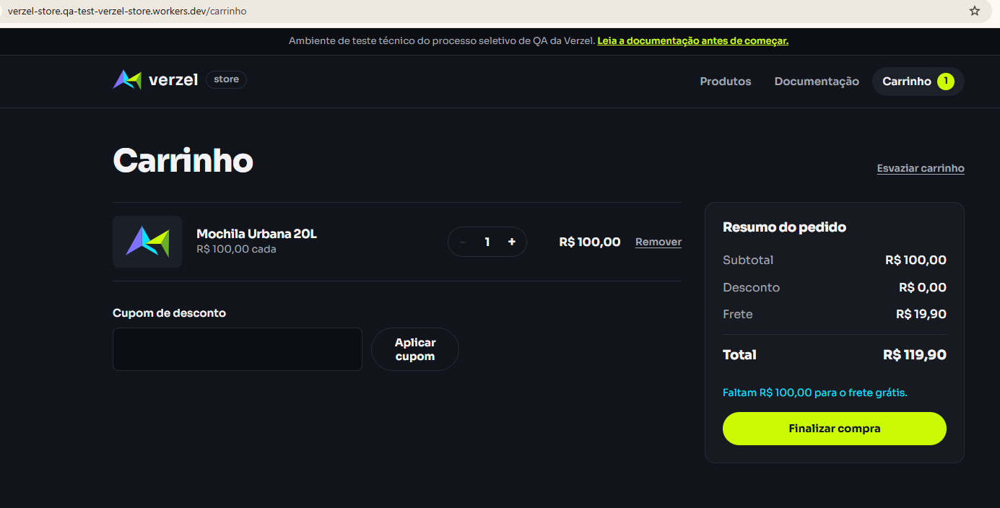

---

### CT-011 - Validar frete grátis considerando o subtotal antes do desconto

**Critério relacionado:** CA08  
**Status:** ✅ PASSOU 
**Evidência:** EV-CT011  

**Resultado esperado:**  
Com subtotal de R$ 219,80 e aplicação do cupom BEMVINDO10, deve ser concedido desconto de R$ 21,98. Mesmo que o valor após o desconto seja reduzido para R$ 197,82, o frete deve permanecer grátis, pois a regra de frete deve considerar o subtotal antes da aplicação do desconto.

**Resultado obtido:**  
O sistema apresentou subtotal de R$ 219,80, aplicou desconto de R$ 21,98 e manteve o frete grátis. O total apresentado foi de R$ 197,82.

**Conclusão:**  
O comportamento está de acordo com o especificado no CA08. O frete grátis foi calculado com base no subtotal antes da aplicação do desconto.

**Evidência:**
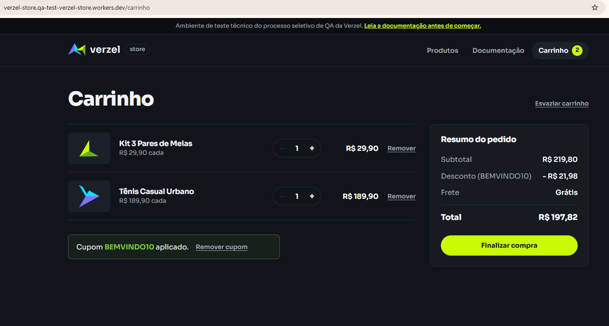

---

### CT-012 - Validar que o desconto do cupom não é aplicado sobre o frete

**Critério relacionado:** CA09  
**Status:** ✅ PASSOU
**Evidência:** EV-CT012  

**Resultado esperado:**  
Com subtotal de R$ 100,00 e aplicação do cupom BEMVINDO10, o desconto deve ser de R$ 10,00, calculado somente sobre o subtotal dos produtos. O frete deve permanecer em R$ 19,90 e o total deve ser R$ 109,90.

**Resultado obtido:**  
O sistema aplicou desconto de R$ 10,00 sobre o subtotal de R$ 100,00, manteve o frete em R$ 19,90 e apresentou total de R$ 109,90.

**Conclusão:**  
O comportamento está de acordo com o especificado no CA09. O desconto do cupom não foi aplicado sobre o valor do frete.

**Evidência:**
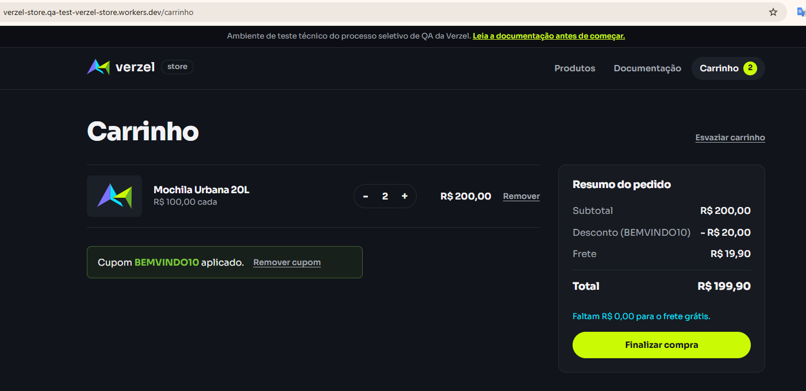

---

### CT-013 - Validar limite máximo de 5 unidades do mesmo produto pela interface

**Critério relacionado:** CA10  
**Camada:** UI  
**Status:** ✅ PASSOU  
**Evidência:** EV-CT013  

**Resultado esperado:**  
O sistema deve permitir no máximo 5 unidades do mesmo produto no carrinho e impedir que o cliente aumente a quantidade para 6 unidades.

**Resultado obtido:**  
Ao atingir 5 unidades do produto, o sistema desabilitou o botão de incremento (+), impedindo o aumento da quantidade. Também foi apresentada a mensagem "Limite de 5 unidades por produto.".

**Conclusão:**  
O comportamento está de acordo com o especificado no CA10 para a camada de UI.

**Evidência:**
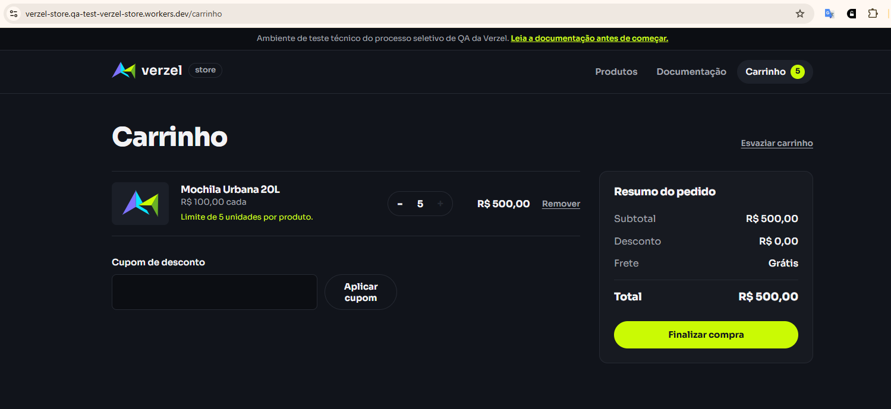

---

### CT-014 - Validar bloqueio de quantidade superior a 5 unidades pela API

**Critério relacionado:** CA10  
**Camada:** API  
**Status:** ❌ FALHOU 
**Evidência:** EV-CT014  
**Bug relacionado:** BUG-002  

**Resultado esperado:**  
Ao enviar uma requisição para calcular o carrinho com 6 unidades do mesmo produto, a API deve rejeitar a quantidade informada, retornar status HTTP 422 e o código "QUANTIDADE_MAXIMA_EXCEDIDA".

**Resultado obtido:**  
Ao enviar 6 unidades do produto P005, a API retornou status HTTP 200 e realizou normalmente o cálculo do carrinho, considerando as 6 unidades do produto.

**Conclusão:**  
O comportamento não está de acordo com o CA10. Embora a interface limite a quantidade a 5 unidades, a API permite quantidade superior ao máximo estabelecido.

**Evidência:**
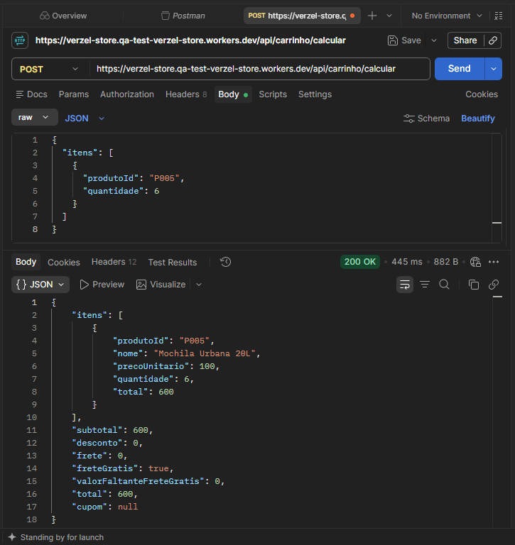

---

### CT-015 - Validar apresentação dos valores monetários com duas casas decimais

**Critério relacionado:** CA11  
**Status:** ✅ PASSOU  
**Evidência:** EV-CT015  

**Resultado esperado:**  
Os valores monetários apresentados no carrinho devem possuir duas casas decimais. Para uma Camiseta Essencial de R$ 59,90 com o cupom BEMVINDO10, o desconto deve ser R$ 5,99, o frete R$ 19,90 e o total R$ 73,81.

**Resultado obtido:**  
O sistema apresentou subtotal de R$ 59,90, desconto de R$ 5,99, frete de R$ 19,90 e total de R$ 73,81, mantendo duas casas decimais nos valores monetários.

**Conclusão:**  
O comportamento apresentado está de acordo com o CA11 para os dados disponíveis no cenário executado.

**Evidência:**
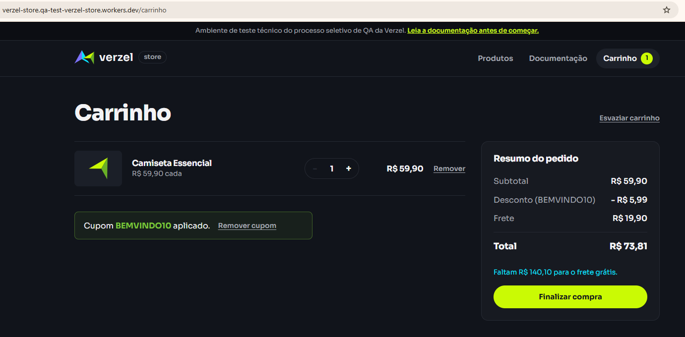

---