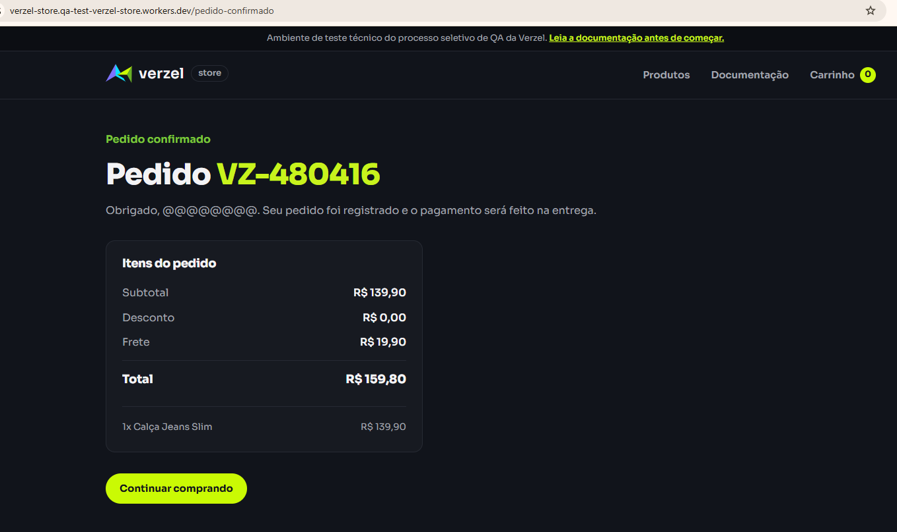

# Bugs encontrados - Verzel Store

## BUG-001 — Frete grátis não é aplicado para subtotal exatamente igual a R$ 200,00

**Critério relacionado:** CA06  
**Cenários relacionados:** CT-008 e CT-009-1  
**Severidade:** Média  
**Prioridade sugerida:** Alta  
**Status:** Aberto  

### Pré-condições

- Carrinho vazio.
- Nenhum cupom aplicado.

### Passos para reproduzir

1. Adicionar a "Mochila Urbana 20L" ao carrinho.
2. Alterar a quantidade para 2 unidades.
3. Acessar o carrinho.
4. Observar o resumo do pedido.

### Resultado atual

O subtotal é R$ 200,00, porém é cobrado frete de R$ 19,90, resultando em um total de R$ 219,90. A interface também informa "Faltam R$ 0,00 para o frete grátis."

O mesmo comportamento foi identificado diretamente na API.

### Resultado esperado

Conforme o CA06, compras com subtotal a partir de R$ 200,00, inclusive, devem possuir frete grátis. Portanto, o frete deveria ser R$ 0,00 e o total R$ 200,00.

### Evidências

**Interface (UI):**


**API:**


---

## BUG-002 — API permite quantidade superior a 5 unidades do mesmo produto

**Critério relacionado:** CA10  
**Cenário relacionado:** CT-014  
**Severidade:** Alta  
**Prioridade sugerida:** Alta  
**Status:** Aberto  

### Pré-condições

- API disponível.
- Produto P005 existente.

### Passos para reproduzir

1. Enviar uma requisição POST para `/api/carrinho/calcular`.
2. Informar o produto P005 com quantidade igual a 6, utilizando o seguinte corpo:

```json
{
  "itens": [
    {
      "produtoId": "P005",
      "quantidade": 6
    }
  ]
}
```

3. Executar a requisição.
4. Verificar o status HTTP e o corpo da resposta.

### Resultado atual

Ao enviar 6 unidades do produto P005, a API retorna status HTTP 200 e realiza normalmente o cálculo do carrinho, considerando as 6 unidades do produto.

### Resultado esperado

A API deve rejeitar a quantidade superior a 5 unidades do mesmo produto, retornando status HTTP 422 e o código `QUANTIDADE_MAXIMA_EXCEDIDA`.

### Evidência


---

## BUG-003 — Campo Nome completo permite valores sem letras na finalização do pedido

**Origem:** Teste Exploratório EXP-001  
**Área:** Checkout / Dados para entrega  
**Severidade:** Média  
**Prioridade sugerida:** Média  
**Status:** Aberto  

### Pré-condições

- Possuir ao menos um produto no carrinho.
- Acessar a tela "Finalizar compra".

### Passos para reproduzir

1. Preencher o campo "Nome completo" somente com números, por exemplo: `123456`.
2. Preencher E-mail e CEP com dados válidos.
3. Clicar em "Confirmar pedido".
4. Repetir o teste preenchendo "Nome completo" somente com caracteres especiais, por exemplo: `@#$%`.
5. Clicar novamente em "Confirmar pedido".

### Resultado atual

O sistema aceita valores compostos somente por números ou caracteres especiais como nome completo e permite prosseguir com a confirmação do pedido.

### Resultado esperado

O sistema deve rejeitar entradas que não representem um nome completo válido, conforme a regra de preenchimento de primeiro nome e sobrenome.

### Evidência


